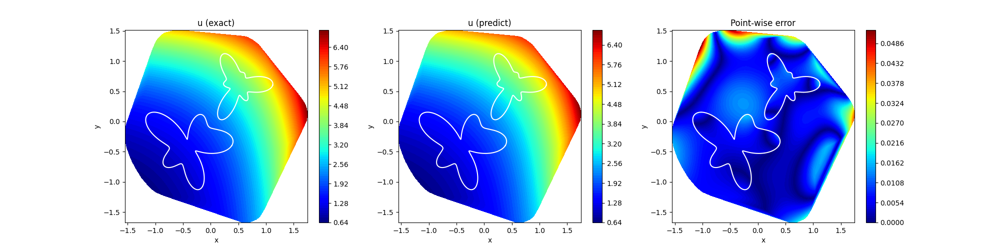

# xpinn
A (unofficial) Pytorch implementation of Extended Physics-Informed Neural Networks (XPINNs)

## Setup
The project is tested under `Python3.10`. Within your virtual env, run the following command to install the required dependencies
```bash
pip install -r requirements.txt
```

## Usage
Code is written to work specifically with the [dataset](./dataset/XPINN_2D_PoissonEqn.mat) provided by the author of XPINN for solving the Poisson's equation:
```math
\left(\frac{\partial^2}{\partial x^2}+\frac{\partial^2}{\partial y^2}\right)u(x,y)=e^x+e^y
```
To train/test model from the command line, simply run
```python
python main.py [mode] [experiment flags]
```
For instance,
```python
python main.py train --exp-name xpinn-train --verbose --save-model
```
To be more specifically, these are experiment flags that can be used for training mode
```
usage: main.py train [-h] [--N-b N_B] [--N-F N_F] [--N-I N_I] [--interfaces INTERFACES [INTERFACES ...]]
                     [--W-u W_U] [--W-F W_F] [--W-I W_I] [--W-IF W_IF] [--epochs EPOCHS] [--lr LR]
                     [--verbose] [--save-model] [--exp-name EXP_NAME] [--seed SEED] [--nondefault-dataset]
                     [--layers LAYERS [LAYERS ...]]

options:
  -h, --help            show this help message and exit
  --N-b N_B             Number of boundary points in each subdomain
  --N-F N_F             Number of residual points in each subdomain
  --N-I N_I             Number of interface points in each interface
  --interfaces INTERFACES [INTERFACES ...]
                        Interface list. E.g., [[sd1_idx, sd2_idx], [sd1_idx, sd3_idx], [sd3_idx,
                        sd4_idx]]]
  --W-u W_U             Data mismatch weight
  --W-F W_F             Residual weight
  --W-I W_I             Average solution continuity weight
  --W-IF W_IF           Residual continuity weight along the interface
  --epochs EPOCHS       Number of epochs
  --lr LR               Learning rate
  --verbose             Whether to display training log
  --save-model          Whether to save the model
  --exp-name EXP_NAME   Experiment name
  --seed SEED           Seed for RNG
  --nondefault-dataset  Whether to use the default dataset
  --layers LAYERS [LAYERS ...]
                        MLP architectures of subnets
```
and for testing mode
```
usage: main.py test [-h] [--model-path MODEL_PATH] [--exp-name EXP_NAME] [--seed SEED]
                    [--nondefault-dataset] [--layers LAYERS [LAYERS ...]]

options:
  -h, --help            show this help message and exit
  --model-path MODEL_PATH
                        Model path to load
  --exp-name EXP_NAME   Experiment name
  --seed SEED           Seed for RNG
  --nondefault-dataset  Whether to use the default dataset
  --layers LAYERS [LAYERS ...]
                        MLP architectures of subnets
```

### Running with your own problem
1. Firstly, in `utils.py` you need to define your PDE in `pde()` to replace the default `poisson_exp()` function .
2. Next, also  in `utils.py` you will have to implement the `load_dataset()` function.
3. Lastly, when training/testing the model, you must call the `--nondefault-dataset` tag.
4. You might have to make some more minor modification depends on your problem.

## Results
This is the result for running the model with default parameters


## References
[1] Ameya Dilip Jagtap, G. Karniadakis. [Extended Physics-informed Neural Networks (XPINNs): A Generalized Space-Time Domain Decomposition based Deep Learning Framework for Nonlinear Partial Differential Equations](https://doi.org/10.4208/cicp.OA-2020-0164). Communications in Computational Physics, 2020.

## License
[MIT](https://choosealicense.com/licenses/mit/)
